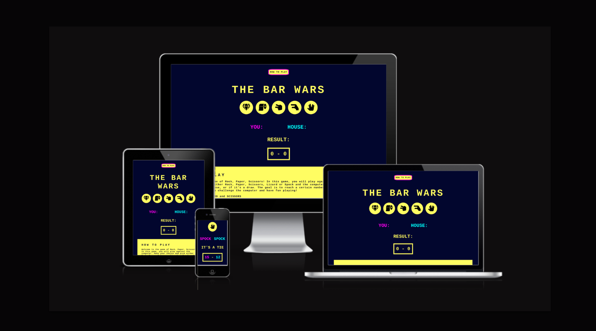
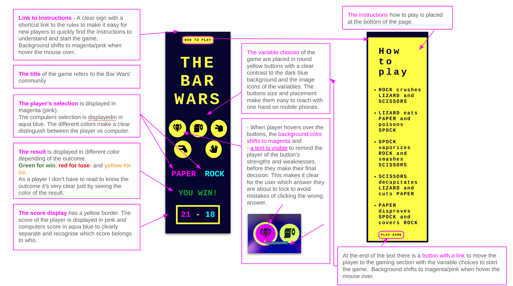

## The Bar Wars game 
– Rock, paper, scissors, lizard, Spock

Rock, paper, scissors, lizard, Spock.....

The game is based on the five elements theory and the episode of the comedy series “The big bang theory” in which Sheldon expands the ”Rock-paper-scissors"game to include “lizard” and “Spock” to increase the randomness of the outcome.

https://www.youtube.com/watch?v=iSHPVCBsnLw&t=0s

Through global symbols and colors for pass and failure, this game can be used by anyone who is curious to play - or need to make a quick decision.

This project is developed as a gift for the Bar Wars community. A group of people who get together for drinks and to watch Star Wars movies. This is a yearly tradition and takes place the night before Christmas eve.

The Bar Wars game can be used for planning and making decisions for the event. What movies will you watch? Who will get the next round? 

It can also be used as paus entertainment. Play by yourself or challenge a friend, who is the best out of five?

## Wireframes and features

------
