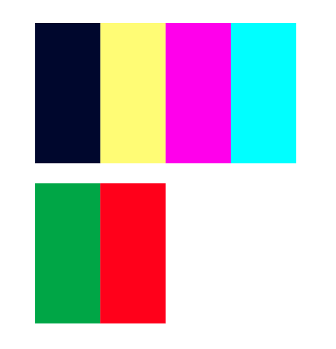

## The Bar Wars game 
– Rock, paper, scissors, lizard, Spock

Through global symbols and colors for pass and failure, this game can be used by anyone who is curious to play - or need to make a quick decision.

This project is developed as a gift for the Bar Wars community. A group of people who get together for drinks and to watch Star Wars movies. This is a yearly tradition and takes place the night before Christmas eve.

The Bar Wars game can be used for planning and decision making. What movies will you watch? Who will get the next round?  

In case of any clash of opinions the situation will quickly be solved with this game. 

Make it easy and let the game decide!

The game is based on the five elements theory and the episode of the comedy series “The big bang theory” in which Sheldon expands the ”Rock-paper-scissors"game to include “lizard” and “Spock” to increase the randomness of the outcome.
https://www.youtube.com/watch?v=iSHPVCBsnLw&t=0s

## Goal

### Project goal

* Design  a stylish and engaging user interface for a rock-paper-scissors game 
* Using JavaScript to implement functions  such as:
	* Managing player choices
	* Generating computer selections
	* Determining round winners
* Update the game interface dynamically based on player interactions to display
	* Selections
	* Round result
	* Total scores

### User goal
New visitors shall quickly recognize the traditional game of Paper, Rock and Scissors

* The extra variables creates curiosity and willingness to try it out  
* The rules of the game and logic between the five elements/variables should be easy to reach
* The user/player shall have a clear overview and understanding of each button/choice/variable to be able to make an active choice rather than a random pick.  

## Design

### The colors
The colors are inspired from Starwars and lasers. Dark blue background with text and elements in yellow, pink and aqua  makes a good contrast. Red and green are used as signal colors for win and lose.

* Dark blue #050530ff
* Red #ff000cff
* Yellow #fffe47ff
* Magenta #ff00f8ff
* Aqua blue #00ffffff
* Green #00a429ff
* Red #ff000cff

------

### Typography
The courier font is inspired from typewriter and text code to match the beginning of digital age era

The icons of common illustrations by Font awesome are used for the variable buttons

### Wireframes 
Wireframes for desktop and mobile screen size

------

### Accessibility
* Structure of semantic html
* Meta tags and description
* Icons with aria labels
* Buttons with titles
* Responsive design
* Colors with good contrast
* Standard font
* Try/catch added for quicker troubleshooting

## Features

------

### Shortcut link
First in place is a link to the instructions of the game to make it easy and quick for the visitor to decide if the game is for them or not.

------

### Heading
The title of the game refers to the name of a community called The Bar wars. 

The title is yellow with font in uppercase. Colors are inspired by stars and lasers.

------

### Buttons with variable choices
The variable choices in black shown as icons in round yellow buttons placed on a dark blue background.

The color combination makes a clear contrast and makes it comfortable to play even in places with little light and on small screen sizes. 

Responsive design makes buttons’ size and position easy to reach with one hand on mobile phones.

------

### Mouse hovers 

When the player hovers over the buttons to make their selection, the background color shifts to magenta and  a text is visible to remind the player of the button’s strengths and weaknesses, before they make their final decision. This makes it clear for the user which answer they are about to click to avoid mistakes of clicking the wrong answer.

------

### The selections
Player’s (You) selection is displayed in magenta (pink) and the computer's (House) selection is displayed in aqua blue. 

The different colors make a clear distinction between the player’s and computer’s bet.

------
### The Result
The result is displayed in different colors depending on the outcome. 

* Green if you win
* Red if you lose
* Yellow if it's a tie

As a player I don’t have to read to know the outcome; it's very clear just by seeing the color of the result.

------
### Score display
The score display has a yellow border. 

The score of the player is displayed in pink and computers score in aqua blue 

This clearly separates  which score belongs to who.

------
### Instructions
The instructions on how to play are placed at the bottom of the page.

At the end of the text there is a button with a link to take the player to the section with the variable choices to start the game.  

The link's background shifts to magenta/pink when hovering the mouse over.

------

## Future Features
* Save high score list
* Add player to play against

------
## Technologies applied
Languages:
HTML
CSS
Javascript

Use HTML and CSS to design an attractive and intuitive interface for the Rock-Paper-Scissors game.

Write JavaScript to manage player choices, generate computer selections, and determine round outcomes.

Dynamically update HTML content with JavaScript to display current selections, round results and total score.

React to user click by adding event listeners for the rock, paper, and scissors buttons.

## Testing
* W3C Validator
* HTML W3C Validator
* CSS W3C Validator

## Tools
FontAwesome, https://fontawesome.com/

Am I responsive?, https://ui.dev/amiresponsive

Grammarly, https://app.grammarly.com/

## Tutorials & credits
Build Rock-paper-scissors basic structure https://youtu.be/ec8vSKJuZTk?si=0kYT0P_LqSiH0Yy9
https://hackr.io/blog/how-to-build-rock-paper-scissors-in-javascript

How to build rock, paper, scissors and readme file
https://hackr.io/blog/how-to-build-rock-paper-scissors-in-javascript

Add basic CSS
https://youtu.be/3uKdQx-SZ5A?si=144oOFE4EclM_bO3

Add aria https://youtu.be/P_H4_miTKsI?si=FqNEw6qp7DAeGpIN

Add Try/Catch 

Inspiration for readme  https://hackr.io/blog/how-to-build-rock-paper-scissors-in-javascript)

