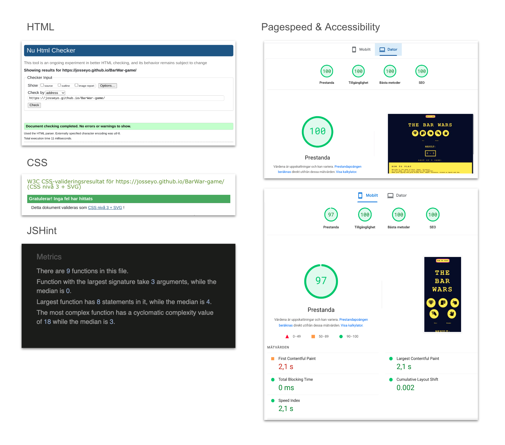

## The Bar Wars game 
Rock – Paper – Scissors – Lizard – Spock

* Select from **rock, paper, scissors, lizard, spock**, and play against the House (computer)
* Best of five wins the game

The Bar Wars game is based on the classic game of Rock, paper and scissors with an addition of Lizard and Spock.

The game can be used for paus entartainment or for planning and decision making. What movies will you watch? Who will get the next round? 

In case of any clash of opinions the situation will quickly be settled with this game. 

Make it easy and let the game begin!

## Objectives

### Project objectives

* Design a clean retro-stylish and engaging user interface for a rock-paper-scissors game 
* Using JavaScript to implement functions such as:

	* Managing player choices
	* Generating computer selections
	* Determining round winner
	* Update the game interface dynamically based on player interactions clicking any of the buttons
	* Display result
	* Total scores
	* Display the winner (best of five wins)

### User objectives
New visitors shall quickly recognize the traditional game of Paper, Rock and Scissors

* The extra variables creates curiosity and willingness to try it out  
* The rules of the game and logic between the five elements/variables should be easy to reach
* The user/player shall have a clear overview and understanding of each button/choice/variable to be able to make an active choice rather than a random pick.  

## Design

### The colors
The colors are inspired from space and lasers. Dark blue background with text and elements in yellow, pink and aqua makes a good contrast. Red and green are used as signal colors for win and lose.

* Dark blue #050530ff
* Red #ff000cff
* Yellow #fffe47ff
* Magenta #ff00f8ff
* Aqua blue #00ffffff
* Green #00a429ff
* Red #ff000cff

### Typography
The typewriter-like appearance of Courier adds a retro and nostalgic touch, complementing the classic and timeless nature of the Paper, Scissors, Rock game. Its monospaced design enhance the overall visual appeal and readability of the game interface.

The icons of common illustrations by Font awesome are used for the different buttons.

### Wireframes 
Wireframes for desktop and mobile screen size

------
### Accessibility
* Structure of semantic html
* Meta tags and description
* Icons with aria labels
* Buttons with titles
* Responsive design
* Colors with good contrast
* Standard font
* Try/catch added for quicker troubleshooting

## Features

------
### Shortcut link
First in place is a link to the instructions of the game to make it easy and quick for the visitor to decide if the game is for them or not.

------
### Heading
* The name of the game refers to a community tradition called The Bar wars. 

* The heading is yellow with font in uppercase. Colors are inspired by stars,space and lasers. The darkblue background creates a clear contrast
to the heading

------
### Buttons with variable choices
* The variable choices in black shown as icons in round yellow buttons placed on a dark blue background.

* The color combination makes a clear contrast and makes it comfortable to play even in places with little light and on small screen sizes. 

* Responsive design makes buttons’ size and position easy to reach with one hand on mobile phones.

------
### Mouse hovers 
When the player hovers over the buttons to make their selection;
* Background color shifts to magenta
* Explanatory text is visible to remind the player of the button’s strengths and weaknesses. 

This makes it clear for the user which answer they are about to click 
to avoid mistakes of clicking the wrong answer.

------
### The selections
* Player’s (You) selection is displayed in magenta (pink)
* Computer's (House) selection is displayed in aqua blue

The different colors make a clear distinction between the player’s and computer’s bet.

------
### The Result
The result is displayed in different colors depending on the outcome. 

* Green if you win
* Red if you lose
* Yellow if it's a tie

As a player I don’t have to read to know the outcome; it's very clear just by seeing the color of the result.

------
### Score display
* The score display has a yellow border. 
* The score of the player is displayed in pink and computers score in aqua blue 

This clearly separates which score belongs to who.

------
### Best of five
* Best of five wins 
* If player is the winner the text is displayed in magenta (pink)
* If the house is the winner, the text is displayed in aqua blue

The colors of magenta and aqua makes it clear who wins even without reading the text.

------
### Play again
To play again after a round of 'Best of five':
* Click the button to reload the page. This will reset the game so you can play again

------
### Instructions
* The instructions on how to play are placed at the bottom of the page.

* At the end of the text there is a button with a link to take the player to the section with the variable choices to start the game.  

* The link's background shifts to magenta/pink when hovering the mouse over.

------
## Future Features
* Save high score list
* Add player to play against

## Technologies applied
Languages:
* HTML
* CSS
* Javascript

## Testing
**Code work as intended**
It implements the logic for playing the best out of 5 rounds of the rock-paper-scissors-lizard-spock game.

The key parts of the code:
1. The `clickButtons` function sets up event listeners on the buttons, allowing the player to make their choices.
2. The `playGame` function handles the gameplay logic. It checks if the number of rounds less than 5. If so, it calls the `determineWinner` function, displays the result, and increments the rounds played. If 5 rounds have been played, it calls the `overallWinner` function.
3. The `determineWinner` function determines the winner of a single round based on the player's and computer's choices.
4. The display updates the scores and its color on the page based on the result of each round.
5. The `overallWinner` function is called after 5 rounds have been played. It compares the final scores of the player and the computer to determine the overall winner of the best-of-five series.

**Code validated without errors:**
* HTML W3 Validator	✅
* CSS W3C Validator	✅
* Try/catch			✅
* JSHint			✅	
* Accessibility		✅	

## Manual testing
Features work as intended**

 |                                                                                                 |                                       |                                                                                                                                                                    |            |            |             |
| ------------------------------------------------------------------------------------------------ | ------------------------------------- | ------------------------------------------------------------------------------------------------------------------------------------------------------------------ | ---------- | ---------- | ----------- |
| **Feature**                                                                                      | **Test case**                         | **Outcome**                                                                                                                                                        | **Chrome** | **Safari** | **Firefox** |
| Shortcut-link to instructions of the game         | Click on the shortcut link            | User is brought to the instruction section at the bottom of the page. Button shifts color when hovering over                                                       | ✅          | ✅          | ✅           |
| Buttons with the variable choices to play                                                        | Hover over the button with the  mouse | When hovering over the buttons, they  shift color and a text shows up explaining the feature of the button                                                         | ✅          | ✅          | ✅           |
| Update and display Player’s and computer’s selection                                          | Click any of the buttons              | Player’s selection is displayed in magenta (pink).The computer’s selection is displayed in aqua blue.Result of the round in magenta or aqua, depending of who wins | ✅          | ✅          | ✅           |
| Result display                                                                                    | Update result                          |The display updates the scores and its color on the page based on the result of each round.| ✅          | ✅          | ✅           |
| Score display                                                                                    | Update score                          | Depending on who scores the score of the player is updated and displayed in pink. Computers score is updated and displayed with aqua blue number                   | ✅          | ✅          | ✅           |
| Best of five                                                                                     | Display the best of five winner       | The winner  of  best of five is announced with text in magenta if the player wins, else in aqua blue if the House is  the winner.                                  | ✅          | ✅          | ✅           |
| Play again                                                                                       | Click the button                      | Page reloads and game is reset so that I can play again                                                                                                            | ✅          | ✅          | ✅           |
| Link at  end  of instructions as shortcut to the selection of buttons to start playing the game. | Click on the shortcut link            | Background shifts to magenta/pink when I hover the mouse over.When I click on the link I am taken to the section with variable choices to start the game.          | ✅          | ✅          | ✅           |

------
**Tested in following browsers:**

Chrome - Version 123.0.6312.59 (Officiell version) (x86_64)
Safari - Version 15.6.1 (17613.3.9.1.16)
Firefox - Version 123.0

------ 
**Responsiveness tested for following screen sizes:**

Desktop - 1600 x 992 px
Laptop - 1280 x 802 px 
Tablet - 768 x 1024 px 
Mobile - 414 x 896 px
Mobile - 320 x 480 px 

------
## Fixes 

* Include a loop Buttons using an event listener
* Break things down into smaller functions
* Style edited for better user experience 
* Add aria label and use as variable id:s
* Create new divs for the "player" and " cpu" titles
* Keep feature image in readme, but include features in text as well
* Delete < br > in ul to fix error in html validation
* Add try/catch to trouble shooting functions
* Add 'use strict' to beginning of js file to fix warning in JSHint;"Missing 'use strict' statement" 
* Add /*eslint-env es6*/ to beginning of js file to specify ECMAScript version to fix warning in JSHint
* Include local deployment in readme
* Screenshots for validation
* Play again button that reloads the page - Create a button and then add a click event
* Bigger font size
* Fix colors to follow the design with magenta for player feedback and aqua for computer feedback to easily separate which data belongs to who.

 ## Deployment

The site was deployed to GitHub pages. The way I manage that:
* Navigate to my GitHub repository page
* From the setting tab (above the repository) click setting tab.
* Select Pages in the left-hand menu
* Section Build and deployment- source select Deploy from a branch
* Select main in first area and root in second area
* Save
* You find the public site here: https://josseyo.github.io/BarWar-game/

### Local deployment
I also made a local deployment. The way I managed that:
* Navigate to my GitHub repository page
* On the main repository page, click the green Code button
* In the menu that appears, click Download ZIP to download repository to my computer as a zipped file
* Unzip the repository-files in a folder on your computer
* Click on the html-file to open the webpage in your browser
 
### Mention 
* Best of five and play again button was added as extras at. the end of project, therefore they are not shown in the wireframes.
* I started in one repository to play around and continued in a new repository to make cleaner and neater commits to the code.
Link to the first repository https://github.com/Josseyo/PP2.git
 
## Tools
* Gitpod
* Github
* Google
* Am I responsive? https://ui.dev/amiresponsive
* Grammarly https://app.grammarly.com/
* Speed test, https://pagespeed.web.dev/
* Javascript test, https://jshint.com/
* Html validator, https://validator.w3.org
* CSS validator, https://jigsaw.w3.org/css-validator

## Resources
* FontAwesome
* Google fonts

## Tutorials & Inspirations
Credits to all the providers for all the inspirations and learnings from following sources

* Build Rock-paper-scissors basic structure https://youtu.be/ec8vSKJuZTk?si=0kYT0P_LqSiH0Yy9
https://hackr.io/blog/how-to-build-rock-paper-scissors-in-javascript

* How to build rock, paper, scissors and readme file
https://hackr.io/blog/how-to-build-rock-paper-scissors-in-javascript

* Add basic CSS
https://youtu.be/3uKdQx-SZ5A?si=144oOFE4EclM_bO3

* Add aria https://youtu.be/P_H4_miTKsI?si=FqNEw6qp7DAeGpIN

* Inspiration for readme https://hackr.io/blog/how-to-build-rock-paper-scissors-in-javascript)

* Buttons using an event listener https://sebhastian.com/rock-paper-scissors-javascript/ 
https://fjolt.com/articlejavascript-multiple-elements-addeventlistener

* Bro Code, javascript full cours for free (2024) https://youtu.be/lfmg-EJ8gm4?si=8UWH-9nR20S0VXzS

* Add Try/Catch https://www.w3schools.com/jsref/jsref_try_catch.asp

* The game is based on the five elements theory and the episode of the comedy series “The big bang theory” in which Sheldon expands the ”Rock-paper-scissors"game to include “lizard” and “Spock” to increase the randomness of the outcome.

* This project is developed as a gift for the Bar Wars community. A group of people who get together to watch Star Wars movies the night before Christmas eve as a yearly tradition. 
Special thanks to Veronika, Birger, Mia & Sanna for the idea of making this game.

------
**Thanks for playing!**

------